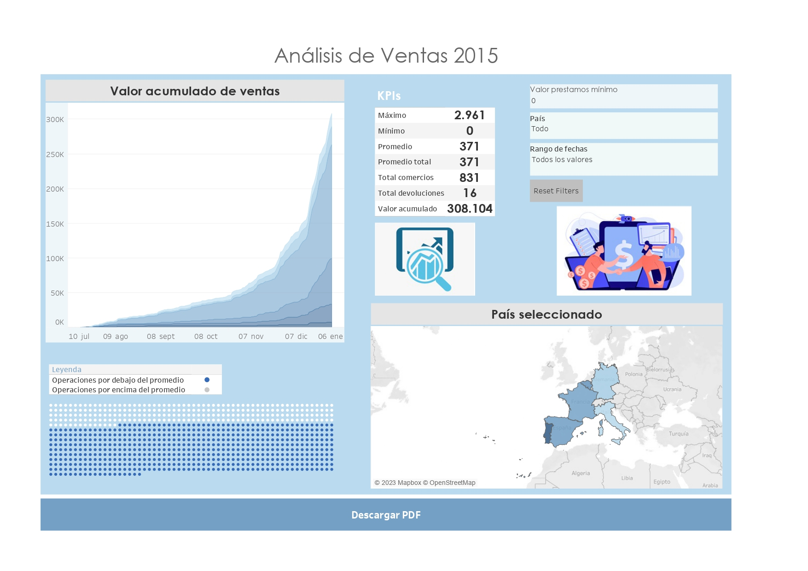

# Tableau Project Repository

## Overview

Welcome to the Tableau Project repository! This repository contains the resources and artifacts for a Tableau data visualization project. The project focuses on analyzing operations conducted by a financial company that grants loans in various establishments for the acquisition of products. The analysis pertains specifically to operations carried out during the fiscal year 2015.

The financial company finances customer purchases from affiliated merchants, with customers obligated to repay the loans over a subsequent period after making the purchase. The dataset includes three CSV files, which are detailed in the documentation section of the virtual campus:

1. **Orders**: Contains information about all transactions, including a status field indicating the state of the operation (Active, Closed, Delinquent, Cancelled).

2. **Refunds**: Documents instances where customers decide not to keep the purchased products and return them. Refunds may involve one or more payments, and the refunded amount is returned to the respective merchant.

3. **Merchants**: Provides details about merchants, including a unique ID and their brand name.

For further details see: `./docs/BusinessIntelligenceEnunciado.pdf`.

## Tableau Dashboard

### Análisis de ventas 2015

The Loan Insights Dashboard aims to reflect loans made by country, visualizing the total loan amount, maximum and minimum loans, and the deviation of these loans from a minimum amount. The dashboard also displays the average loan amount. Users can filter this data by country and time slot.

**Screenshot:**

### Getting Started

To explore the Tableau dashboard, follow these steps:
1. **Download and Open in Tableau Desktop:**
   - Clone or download this repository.
   - Open the `.twb` or `.twbx` file in Tableau Desktop to interact with the dashboard locally. The Custom version is the latest one.

### Data Sources

All the necessary data for this project is present in tables within a single Excel file named **Operaciones_financiación_compras_2015.xlsx**. The tables included are:

1. **Orders:** Contains information about all transactions, including a status field indicating the state of the operation (Active, Closed, Delinquent, Cancelled).

2. **Refunds:** Documents instances where customers decide not to keep the purchased products and return them. Refunds may involve one or more payments, and the refunded amount is returned to the respective merchant.

3. **Merchants:** Provides details about merchants, including a unique ID and their brand name.

To prepare the data for analysis, we perform the following steps:

- **Right Join between Orders and Merchants:** We create a right join between the Orders and Merchants tables, combining information about transactions and merchant details.

- **Relation with Refunds Table:** A relationship is established between this joined table and the Refunds table using the Order Id attribute, allowing us to incorporate information about customer refunds into the analysis.

### Dashboard Features

The Loan Insights Dashboard provides the following key features:

- **[Feature 1]: Country Map**
  - We incorporate a dynamic country map visualization that highlights loan-related insights across different countries. The map is interactive and responds to filters applied to the dataset.

- **[Feature 2]: Deviation Graphic**
  - A deviation graphic is included, visually representing the deviation of loans from a minimum amount. This provides a quick overview of how individual loans compare to the set minimum.

- **[Feature 3]: KPI Tables**
  - KPI tables showcase key metrics, including mean loan amount, maximum loan amount, and minimum loan amount. These tables offer a concise summary of important loan statistics.

- **[Feature 4]: Cumulated Graphic**
  - A cumulated graphic illustrates the total loan amount cumulatively across different countries. This visualization helps in understanding the overall loan distribution.

- **Interactive Filters:**
  - The dashboard incorporates interactive filters based on country and time. Users can easily customize the visualizations by selecting specific countries and adjusting the time frame.

- **Reset Filters Button:**
  - A convenient "Reset Filters" button is available to revert all applied filters, providing a hassle-free way to return to the default view.

- **PDF Download Button:**
  - Users have the option to download the dashboard in PDF format using a dedicated button. This feature facilitates the sharing and documentation of insights derived from the visualizations.

## Project Structure

The repository is organized as follows:

- **`/data`:** Contains the raw data used in the project.
- **`/images`:** Screenshots of the Tableau dashboard for reference.
- **`/docs`:** Contains the documentation to solve the problem.

## Requirements

- Tableau Desktop Professional Edition 2023.3.0

## Contributing

If you would like to contribute to this project, feel free to submit a pull request. For major changes, please open an issue first to discuss the proposed changes.

## License

This project is licensed under the MIT. See the [LICENSE](LICENSE) file for details.

## Acknowledgments

Thank you for exploring this Tableau Project! If you have any questions or feedback, feel free to open an issue or contact alejbormeg@gmail.com.
